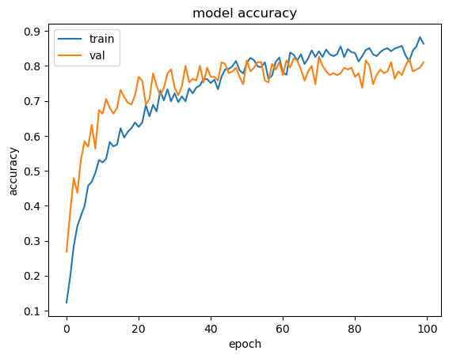
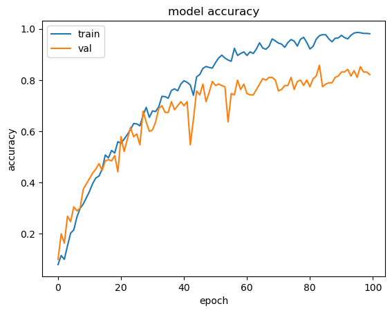
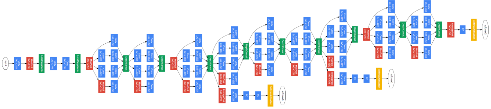

# Projet de Classification des Sports Olympiques sur des Images Télévisées

## Objectif
Ce cahier Jupyter est dédié à la classification des sports olympiques à partir d'images télévisées grâce à des techniques d'apprentissage en profondeur. L'objectif est de concevoir un modèle qui identifie de manière autonome le sport illustré dans une image issue des diffusions télévisées des Jeux Olympiques.

## Approches de Modélisation
Nous avons exploré deux architectures de modèles de deep learning : les Réseaux de Neurones Convolutifs (CNN) et GoogleNet. Ces architectures sont choisies pour leur efficacité reconnue dans les tâches de reconnaissance d'images.

### Réseaux de Neurones Convolutifs (CNN)
- Le modèle CNN a été entraîné sur un ensemble de données composé d'images télévisées variées des Jeux Olympiques.
- La précision du modèle sur les données d'entraînement et de validation peut être visualisée dans l'image `CNNAccuracy.png`.
- Le modèle entraîné est exporté sous le nom `modelCNN32_(333, 187).keras`.

### GoogleNet
- GoogleNet est une architecture plus complexe, connue pour sa capacité à capturer des caractéristiques d'image à différentes échelles.
- La performance de GoogleNet est illustrée dans l'image `GoogleNetAccuracy.png`.
- L'architecture détaillée de GoogleNet est représentée dans l'image `architecture.png`.
- Le modèle GoogleNet entraîné est sauvegardé sous le nom `modelGooglenet32_(333, 187).keras`.

## Résultats et Performance
Les graphiques de précision pour les deux modèles montrent l'évolution de la capacité de classification au fil des époques. Ces métriques sont cruciales pour évaluer les performances et l'efficacité des modèles proposés.

## Utilisation
Ce système de reconnaissance visuelle vise à automatiser la classification des contenus sportifs dans les médias, ce qui peut grandement améliorer l'organisation et l'accessibilité des archives télévisuelles des Jeux Olympiques.

## Fichiers de Modèles
- `modelGooglenet32_(333, 187).keras` : Export du modèle GoogleNet.
- `modelCNN32_(333, 187).keras` : Export du modèle CNN.

## Images

